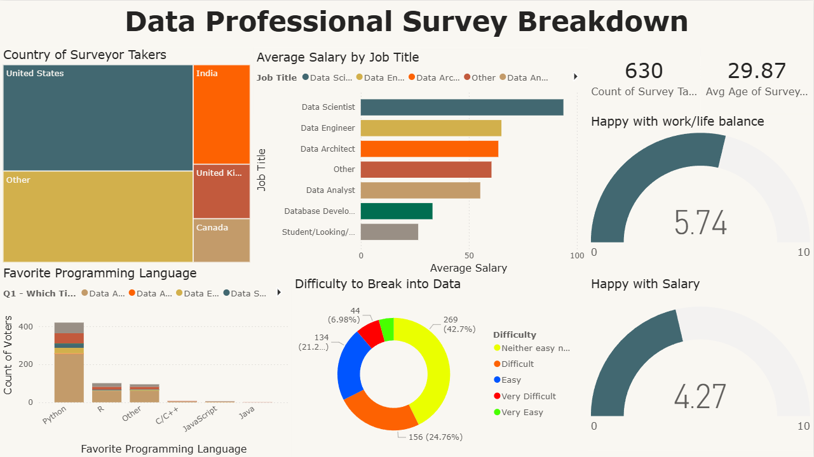

# Data Professional Survey Breakdown 📊

This is my **first Power BI project**, built after completing a 3-hour YouTube course by [Alex the Analyst](https://www.youtube.com/watch?v=I0vQ_VLZTWg).

The dashboard analyzes survey data collected from data professionals, covering 13 questions on roles, salaries, skills, work-life balance, career mobility, and demographics. All survey responses are anonymous.

## 🔹 Dashboard Overview
The dashboard provides insights into:
- Current job titles and career transitions into data
- Salary ranges and satisfaction
- Favorite programming languages
- Work-life balance and career growth
- Education, country, and ethnicity distributions

## 🔹 Tools Used
- Power BI Desktop
- Microsoft Excel (survey dataset)

## 🔹 Data Preparation
- Initially transformed and cleaned using Power Query
- Ensured correct data types and aggregation for visuals

## 🔹 Dashboard Preview

## 🔹 How to Use
1. Download the `.pbix` file
2. Open it using **Power BI Desktop**
3. Refresh data if required

## 🔹 What I Learned
- Building **interactive dashboards** in Power BI
- Using **slicers, filters, and visuals** effectively
- Transforming and modeling data in **Power Query**
- Applying insights to survey data
- How to structure a **one-page dashboard** clearly

---

📌 *This project gave me my first hands-on experience with Power BI and data visualization, and marks the start of my data analytics learning journey.*
